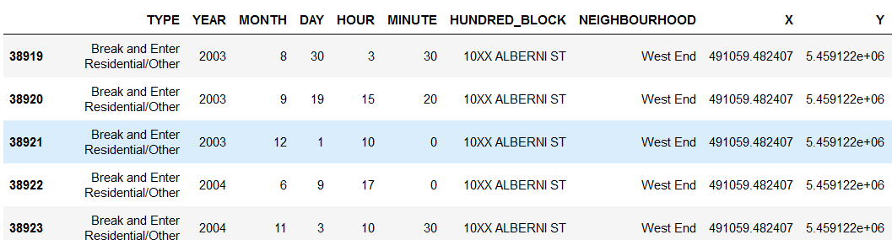
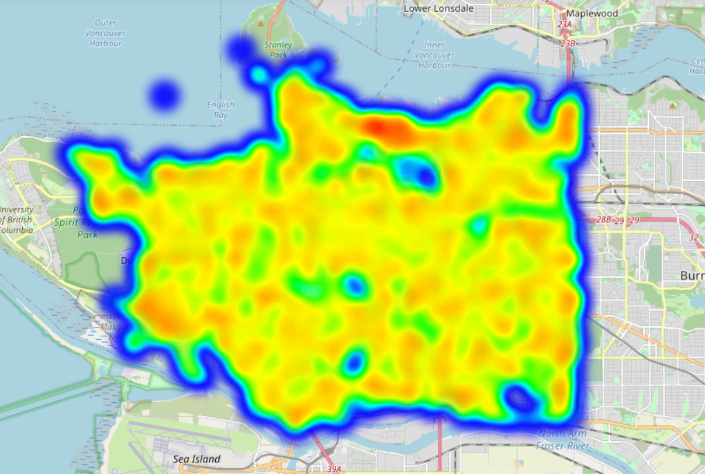
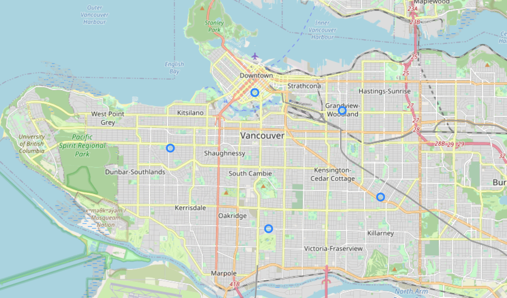

# Real-Estate Analysis of Vancouver Neighbourhoods

## Introduction

In terms of realty analytics, it often involves understanding the basic concepts surrounding the ability of a property's value and obtainable revenue. This, in turn, provides the reason for investment and lots of planning and decision-making for it to succeed. A neighbourhood/community-wise Analysis of Residential Real Estate would provide a better understanding in determining which neighbourhood would offer a good return on investment, which is the goal of this project.

Vancouver is one of the largest and most populous cities in Canada, known for being diverse, multicultural and home to world class-amenities, making it a great place to invest in a house(or an apartment)!

When investing in a property, an overall market analysis will provide a good idea of the trends, but more is needed. It is imperative to buy property in the right neighbourhood because even if the overall market is excellent, a wrong location may lead to decreased property value in the future.

A Neighbourhood Analysis will reveal the investment potential of various neighbourhoods based on their characteristics and intrinsic values.

### Target Audience

This analysis aims to provide more detailed insight for both companies(real estate firms) & individuals who are interested in investing in residential property in Vancouver. In addition, this analysis will provide a comprehensive understanding of the most suitable neighbourhood according to one's needs.


### Part 1: Crime statistics

In terms of value and investment return, a desirable real estate property would exhibit certain features related to pricing, ease of transportation, distance to amenities, and a relatively low crime rate in the neighbourhood. In this section, I’ll demonstrate how Data Science can use pattern detection to identify appealing locations for investment in the metro Vancouver area. The data used in this section was gathered from Vancouver Open Data Catalogue. The data ranges from the year 2003 up to 2017. In addition, I have added serval modifications to the data to illustrate location information better. 

let us start with importing the necessary packages
```
import pandas as pd  
import numpy as np
import matplotlib as mpl
import matplotlib.pyplot as plt
import math
import geopandas
import geopy
from geopy.geocoders import Nominatim
import folium
from geopy.extra.rate_limiter import RateLimiter
from folium import plugins
from folium.plugins import MarkerCluster
from pyproj import Proj
```

Then by looking at the raw data we can see that it contains serval feature sets regarding a single incident. 
```
df = pd.read_csv('crime_records.csv')
df.head(5)
```


We can take a closer look into the type of crime that occurred and the distribution in the overall data set. 
```
 df.groupby("TYPE")["TYPE"].count().sort_values()
 
 TYPE
Homicide                                                     252
Vehicle Collision or Pedestrian Struck (with Fatality)       290
Vehicle Collision or Pedestrian Struck (with Injury)       25294
Theft of Bicycle                                           31112
Break and Enter Commercial                                 38916
Theft of Vehicle                                           41528
Offence Against a Person                                   62078
Other Theft                                                64611
Break and Enter Residential/Other                          66378
Mischief                                                   83970
Theft from Vehicle                                        209609
Name: TYPE, dtype: int64
```

As you can see, the top three often occurred are: "Theft from Vehicle" at 33%, "Mischief" at 13%, and lastly, "Break and Enter Residential/Other" at 11%. 
we can then dig a little deeper into the neighbourhood themselves. 

```
df.groupby("NEIGHBOURHOOD")["NEIGHBOURHOOD"].count().sort_values()

NEIGHBOURHOOD
Musqueam                        571
Stanley Park                   4174
South Cambie                   6043
Shaughnessy                    6321
West Point Grey                6761
Arbutus Ridge                  6819
Kerrisdale                     8470
Dunbar-Southlands              8792
Oakridge                       9281
Killarney                     11847
Victoria-Fraserview           12310
Riley Park                    14663
Marpole                       15137
Sunset                        19686
Hastings-Sunrise              21272
Strathcona                    25809
Kensington-Cedar Cottage      28418
Kitsilano                     30670
Renfrew-Collingwood           31097
Grandview-Woodland            31599
Mount Pleasant                36378
Fairview                      36723
West End                      48722
Central Business District    137513
```

If we transpose these statistics onto the different communities, we can see the top five neighbourhoods with the lowest crime rate are: Musqueam, Stanley Park, South Cambie, Shaughnessy, and West Point Grey. Inversely, the five where crime occurs most often are: Grandview-Woodland, Mount Pleasant, Fairview, West End, and Central Business District. 

Suppose we transfer the data point into a geospatial representation. Then, we can see the different crime locations and generate a heat map of the locations that are more prone to incidents. For this task, I have utilized the folium library, a powerful python library which can produce an interactive and concise leaflet map. 
```
dfmatrix = test2[['Latitude', 'Longitude']].values# plot heatmap
mh.add_child(plugins.HeatMap(dfmatrix, radius=14))
mh
```



A refined filter was applied here, as we are only interested in the locations where a crime related to property occurs. In addition, it must be a more recent incident to reduce the overall noise in the data. Where the timeframe was set after 2012, and it was sampled at 50%. 

We can also go a bit further with our data analysis via clustering; we can divide the processed data into groups using an unsupervised clustering algorithm like k-means. Although I have set the value of K at five by "guesstimate" while we can calculate a value of k using something like the elbow method, this was not the project's main aim. In terms of precision and accuracy, the important point is there is no correct value for K. If we choose a somewhat lower K value, we would not be able to see certain details. Yet, if the value is too high, then the clusters will overlap, and nothing informative will come out.
```
kmeans = KMeans(n_clusters = 5, init ='k-means++')
kmeans.fit(df_kmeans)
df2['cluster_label'] = kmeans.fit_predict(df_kmeans)
centers = kmeans.cluster_centers_ # Coordinates of cluster centers.
labels = kmeans.predict(df_kmeans) # Labels of each point
df2.head(3)
```
Then we can plot the center points via folium



### Part 2: Property analytics

We have selected the necessary neighbourhoods that can provide a good investment return. As for this part, we will look into the different properties within these neighbourhoods and their value from factors such as: financial backgrounds, amenities, accessibilities, transportation, cost, etc. 

##TBC, getting data 


